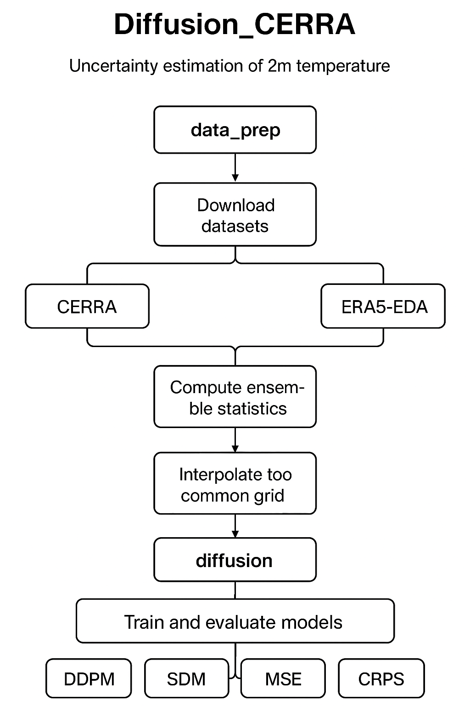

# Diffusion_CERRA

This repository provides a complete workflow for **uncertainty estimation of 2-meter air temperature (T2M)** using  
**CERRA reanalysis** and **ERA5EDA** datasets, with downstream applications to  
**diffusion-based machine learning models**.

The project supports:
- Ensemble mean and standard deviation estimation
- Spatial domain harmonization between CERRA and ERA5-EDA
- Generation of NetCDF outputs and geographic plots
- Training and evaluation of diffusion models for probabilistic forecasting

---

## Repository Overview

The repository is organized into **two main components**:

1. **`data_prep`** – Data download, preprocessing, plotting, and NetCDF generation  
2. **`diffusion`** – Diffusion model training, evaluation, and uncertainty quantification

---

## 1. `data_prep` — Data Preparation & Analysis

This directory contains all scripts required to:
- Create the Python environment
- Download CERRA and ERA5-EDA ensemble data
- Compute ensemble statistics (mean & standard deviation)
- Generate plots and NetCDF files for further analysis

### Contents

#### Environment setup
- **`install_environment.sh`**  
  Creates a Conda/Mamba environment and installs all required Python libraries.

#### Data download
- **`fetch_cerra_t2m.job/fetch_cerra_t2m_nc_ens.py`**  
  Downloads CERRA ensemble 2-meter temperature data.
- **`fetch_era5eda_t2m.job/fetch_err5eda_t2m_nc_ens.py`**  
  Downloads ERA5-EDA ensemble 2-meter temperature data.

#### Processing & plotting
- **`Run_main_cerra_err5eda.job/main_cerra_err5eda.py`**  
  - Computes ensemble mean and standard deviation  
  - Interpolates datasets onto a common spatial domain  
  - Generates daily geographic plots  
  - Writes NetCDF outputs for downstream modeling  

### Directory Structure

```text
data_prep
├── fetch_cerra_t2m.job
│   └── fetch_cerra_t2m_nc_ens.py
├── fetch_era5eda_t2m.job
│   └── fetch_err5eda_t2m_nc_ens.py
├── install_environment.sh
├── main_cerra_err5eda.py
├── Run_main_cerra_err5eda.job
└── README.md

diffusion
├── evaluation
│   ├── evaluate_FIELD.py
│   ├── evaluate.py
│   ├── RMSE_Validation_plot.py
│   └── Run_evaluation.job
├── src_diffusion_DDPM
│   ├── diffusion_train.py
│   ├── diffusion_gaussian.py
│   ├── unet.py
│   └── ...
├── src_diffusion_SDM
│   ├── diffusion_gaussian_CRPS.py
│   ├── score_sde.py
│   ├── unet.py
│   └── ...
└── train_ml
    ├── Run_Training_DDPM.job
    ├── Run_Training_SDM.job
    ├── Train_Main.py
    └── Sample_Main.py

```
## Workflow Diagram

Below is the workflow for the repository:

<p align="center">
  
</p>

## Authors
**Yarong Chen, MISU**;
**Swapan Mallick, SMHI**;
**Daniel Y, SMHI**
